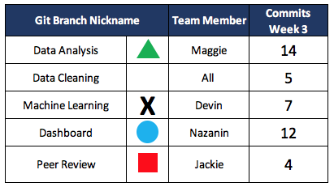

# Liquor Licenses and Close-Proximity Population Demographics

## Presentation

### [Click Here to access Google Sheets presentation](https://docs.google.com/presentation/d/16BIqBy9ejezUTJsVLJnAEyl2HWQhgAKd4O99gPBHUYY/edit#slide=id.p).

## Overview
The CDC publishes a fascinating dataset detailing the racial/ethnic percentages of persons living within **0.25 miles of an establishment with a liquor license**. Much research has been conducted to investigate the relationship between proximity to liquor establsihments and demographics such as race and socioeconomic factors.

By layering additional demographic and socioeconomic data including income levels, poverty, unemployment, housing prices indicators, we can get a better picture of phenomenons that occur such outlets.

**This project hopes to answer the following questions**:

* Is there a racial or ethnic population more likely to live within a quarter-mile of a liquor licensed establishment?
* What is the racial or ethnic breakdown of populations within a quarter-mile of a liquor licensed establishment?
* Is there a correlation between income and proximity to an alcohol outlet?

Ultimately, **the goal is to build a machine learning model that can predict the likelihood of a liquor outlet within a quarter-mile of a person's home based on their race/ethnicity and location.**

## Data Source
There are **4 datasets** that will be used to build this model and create visualizations:

1. The first, and primary, dataset comes from [HealthData.gov](https://healthdata.gov/dataset/population-percentage-within-quarter-mile-alcohol-outlets). This file contains 2014 data for the state of California of population demographics of residents living within a quarter-mile of an alcohol establishment: ```population_pct_within_qrt_mile_alcohol.csv```
 
1. This dataset, from the [HealthData.gov](https://healthdata.gov/dataset/population-percentage-within-quarter-mile-alcohol-outlets), provides county-level data regarding persistent poverty, metro vs non-metro status, low education status, retirement destination, as well as other descriptive, binary factors. ```2015CountyTypologyCodes.csv```
 
1. The file ```personal_income_2014.csv``` also comes from [Bureau of Economic Analysis](https://apps.bea.gov/regional/histdata/) details the per capita personal income by county.

2. The final dataset from the [U.S. Bureau of Labor Statistics](https://www.bls.gov/lau/) , ```UnemploymentReport_CA.csv```, trends out unemployment rate from 2011 through 2019 by County detailing the median house price for that county.

All of these datasets have been filtered to focus on **California and its County-level information targeting 2014**.

### Database
First step in creating this predictive model and getting the answers we are looking for, is to import the raw data into **SQL** and create a schema outlining the table structure and interconnections.

This is done using **PostGres** and **SQL**; ERD schematic below:


Once the team is ready to start analyzing, the data is connected directly to a **Python Notebook** to be read in using importing ```create_engine``` and ```func``` from **sqlalchemy** and ```psycopg2```

At which point we are ready to clean, transform, and preprocess our dataset. That's where the fun begins!

## Machine Learning Model
The following technologies, modules, and functions within Python will be used to read in, prepare and transform the data:

* pandas
* numpy
* pathlib: ```Path```
* matplotlib.pyplot
* collections: ```Counter```
* sklearn.metrics: 
	* ```balanced_accuracy_score```
	* ```confusion_matrix```
	*  ```mean_squared_error```
* sklearn.model_selection: ```train_test_split```
* sklearn.linear_model: ```LinearRegression```
* sklearn.preprocessing: 
	* ```StandardScaler```
	* ```OneHotEncoder```
	*  ```PolynomialFeatures```
* imblearn.metrics: ```classification_report_imbalanced```


Once the dataset is cleaned and transformed, we can start compiling, training, and evaluating the model. A **Linear Regression model** will be employed as the predicted outcome of this model will be in the form of a categorical dependent variable.

Our input factors (y) will include:

 
* ```county_name``` 
* ```geotype```                        
* ```region_name```   
* ```num_people_qrt```                 
* ```tot_people```                     
* ```per_capita_income```              
* ```total_income```                   
* ```population```                     
* ```unemp_2014```                     
* ```median_house_price```             
* ```median_house_pct```               
* ```metro_status```                   
* ```economic_type_label```            
* ```low_education_2015```             
* ```low_employment_cnty```            
* ```pop_loss_2010```                 
* ```retirement_dest_2015```
* ```persistent_poverty_2013```       
* ```persistent_child_poverty_2013```  
* ```race_eth_updt```                                

Our **target or (X)** will be the percentage of the population, ```probablity```, within a quarter mile of the alcohol outlet.

## Dashboard Presentation
The dashboard will be built using **Tableau**. Visualizations to tell this story will include graphs, heat maps, and prediction results.

Our Tableau analysis can be found here: [Tableau Dashboard
](https://public.tableau.com/profile/nazanin6981#!/vizhome/Alcohol_CA_Final/LiquorLicensesandClose-ProximityPopulationDemographics?publish=yes)

*Link to Dashboard can be found in presentation link above.*

## GitHub and Communication Protocol

#### GitHub
In order to accomplish this massive task, this team will be utilizing GitHub to collaborate. In addition to our main (or master branch), this repository contains the following branches organized by function rather than team member for clarity:

* ```dashboard```
* ```data_analysis``` 
* ```data_cleaning``` 
* ```machine_learning``` 

An additional branch was employed as our tasks change throughout this process:

* ```peer_review```  

Each team member has a role to play and for **Week 3**  they are:

* Circle Role (```dashboard```): Nazanin Tavakoli 
* Square Role (```peer_review```): Jackie Chitsanga
* Triangle Role (```data_analysis```): Maggie McPhail
* X Role (```machine_learning```): Devin Hollister

All Team members are responsibile for continued improvement of machine learning and data cleaning.

Each week, our team will have a minimum of 4 commits per member.  For **Week 3**:


#### Communication Protocol
In addition to utilizing **GitHub** and our **Slack** channel, this team will meet weekly during and/or before normal class times on **Monday** and **Wednesday** evenings as well as via **Zoom** as needed.
